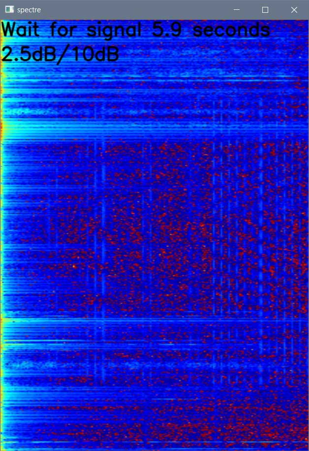

# pyaudiobot
Python audio recorder bot



## Install

1. ```pip3 install pipwin```

2. ```pipwin install pyaudio```

3. ```pip3 install -r requirements.txt```

4. Install **ffmpeg** and **ffprobe**
    * [windows](https://ffmpeg.org/download.html#build-windows) install and move `ffmpeg.exe`, `ffprobe.exe` in **PATH** or in this project folder
    * [linux](https://www.tecmint.com/install-ffmpeg-in-linux/) (just install, it will work)

5. Run and type your `TELEGRAM_BOT_TOKEN` and `TELEGRAM_CHAT_ID` in first start dialog

6. **Optional** You can edit program settings on lines `17..22` as you want

    ``` python
    # program settings
    WINDOW_WIDTH = 500
    WINDOW_HEIGHT = 700

    signal_level_db = 10
    trigger_recording_seconds = 3
    min_recording_seconds = 3
    ```
